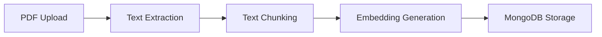
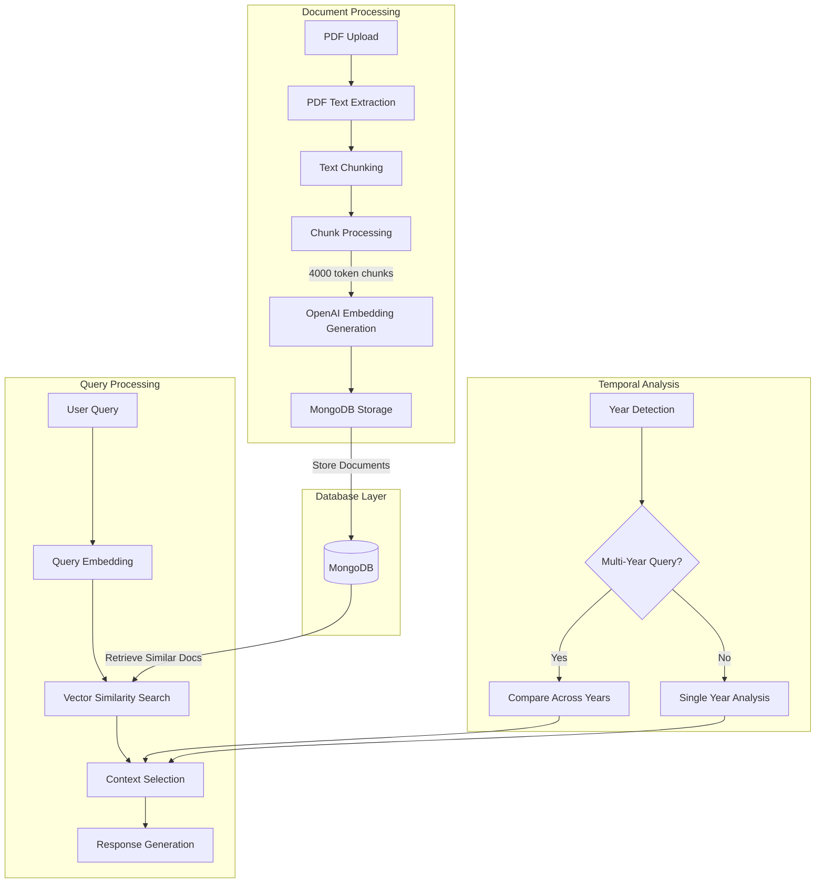
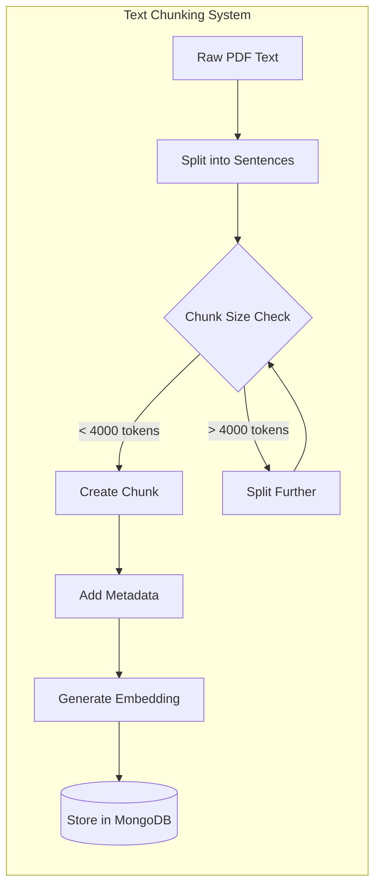
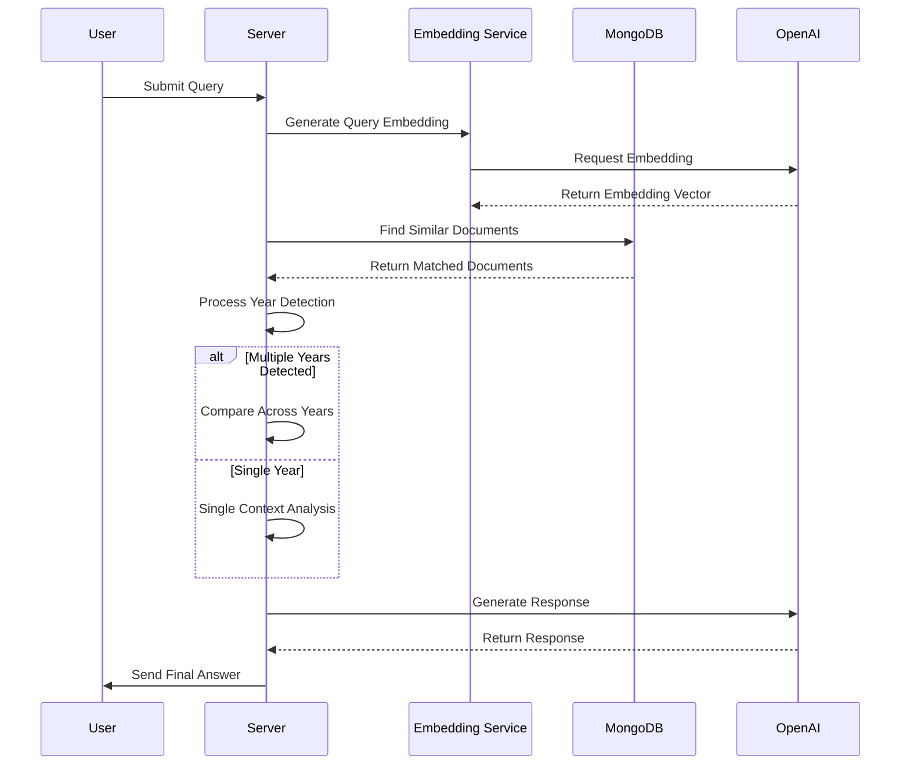
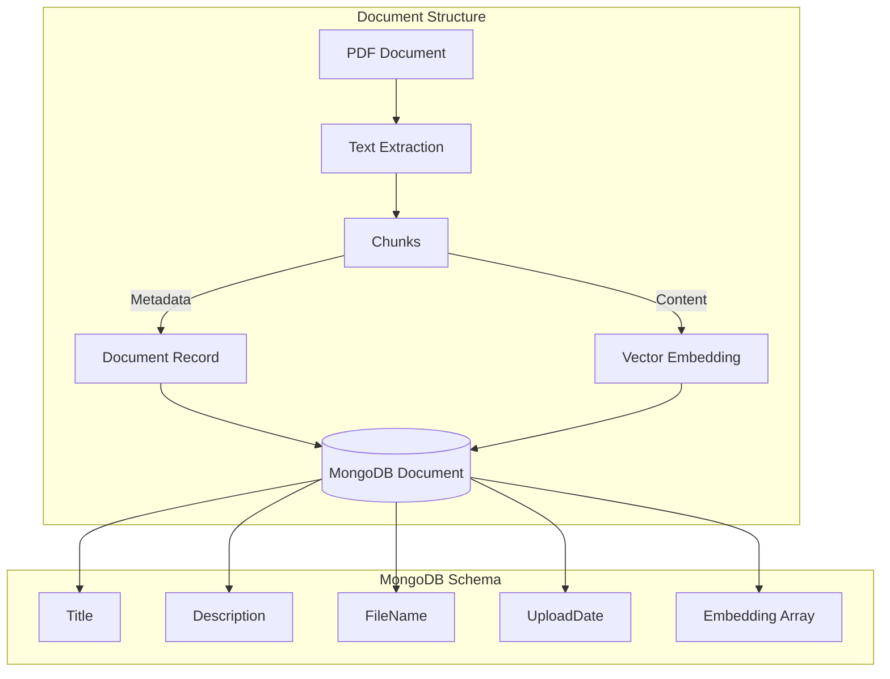

# PDF-RAG-Builder: AI-Powered Document Analysis System

## Tech Stack Overview

### Backend Infrastructure
- **Runtime**: Node.js
- **Server Framework**: Express.js
- **Database**: MongoDB with Mongoose ODM
- **AI Integration**: OpenAI API (text-embedding-3-small model)
- **PDF Processing**: PDFReader

### Key Dependencies
- **openai**: ^4.26.0 - For embedding generation
- **mongoose**: ^8.1.1 - MongoDB object modeling
- **express**: ^4.18.2 - Web server framework
- **pdfreader**: ^3.0.2 - PDF parsing capabilities
- **multer**: ^1.4.5-lts.1 - File upload handling

## AI Model & Database Architecture

### OpenAI Model Implementation
- **Model**: text-embedding-3-small
- **Purpose**: Semantic text embedding generation
- **Vector Dimensions**: High-dimensional floating-point vectors
- **Usage**: Text chunks → Numerical vector representations

### MongoDB Database Design
- **Connection**: Supports both MongoDB Atlas (mongodb+srv://) and local instances (mongodb://)
- **Schema Design**: DocumentUploadSchema
  ```javascript
  {
    title: String,          // Document section identifier
    description: String,    // Raw text content
    fileName: String,       // Source PDF name
    uploadDate: Date,       // Timestamp
    embedding: [Number]     // Vector representation
  }
  ```

## System Design & Data Flow

### 1. Document Processing Pipeline


### 2. Text Chunking System
- **Chunk Size**: 4000 tokens maximum
- **Chunking Strategy**: Sentence-based splitting
- **Preservation**: Maintains sentence integrity
- **Storage**: Each chunk stored with metadata and embedding

### 3. Query Processing Flow


## System Architecture & Data Flow

### Complete System Overview


### Chunk Creation Process


### Query Processing Flow


### Data Structure Flow


## Execution Flow

### 1. Document Upload & Processing
```javascript
PDF Upload → Text Extraction → Chunk Creation → Embedding Generation → MongoDB Storage
```

### 2. Query Processing
```javascript
Query Input → Embedding Creation → Similarity Search → Response Formation
```

### 3. Vector Similarity Implementation
- Uses cosine similarity for comparing embeddings
- Optimized for semantic matching
- Supports contextual understanding


